# LAB-01-MPI-OPENMP-HYBRID | Silvana & Yeferson

> **Asignatura:** Fundamentos de Programación Concurrente y Distribuida

> **Docente:** Prf. Alejandro Jaimes

> **Fecha:** 06/05/2026

> **Repositorio:** [computacion-paralela-distribuida](https://github.com/yeferson59/computacion-paralela-distribuida)

---

## Equipo

|    | Colaborador | GitHub |
|----|-------------|--------|
| 👩🏻‍💻 | Silvana     | [@inana20](https://github.com/inana20) |
| 👨🏻‍💻 | Yeferson    | [@yeferson59](https://github.com/yeferson59) |

---

## Estructura del repositorio

```
computacion-paralela-distribuida/
│
├── README.md
│
├── laboratorios/
│   └── lab_01_mpi_openmp_hybrid/
│       ├── README.md
│       ├── img/
│       │   ├── img-Silvana/
│       │   │   ├── mpi_01_hola.png
│       │   │   ├── mpi_01_hola_2.png
│       │   │   ├── mpi_02_hibrido.png
│       │   │   ├── mpi_02_hibrido_2.png
│       │   │   ├── mpi_03_suma_hibrida.png
│       │   │   ├── mpi_04_speedup.png
│       │   │   ├── mpi_04_speedup_2.png
│       │   │   ├── mpi_04_speedup_3.png
│       │   │   └── mpi_04_speedup_4.png
│       │   └── img-yeferson/
│       │       ├── mpi_01_hola.png
│       │       ├── mpi_01_hola_2.png
│       │       ├── mpi_02_hibrido.png
│       │       ├── mpi_02_hibrido_2.png
│       │       ├── mpi_03_suma_hibrida.png
│       │       ├── mpi_04_speedup.png
│       │       ├── mpi_04_speedup_2.png
│       │       ├── mpi_04_speedup_3.png
│       │       └── mpi_04_speedup_4.png
│       ├── mpi_01_hola.c
│       ├── mpi_02_hibrido.c
│       ├── mpi_03_suma_hibrida.c
│       └── mpi_04_speedup.c
```

---

## Ejercicio 1 — Hola Mundo MPI

**Descripción:** Cada proceso MPI imprime su rank (ID) y el total de procesos activos. El proceso maestro (rank 0) imprime un mensaje adicional al final confirmando que todos los procesos saludaron.

**Compilación y ejecución:**
```bash
mpicc mpi_01_hola.c -o mpi_01_hola.exe
mpiexec -n 4 .\mpi_01_hola.exe
mpiexec -n 2 .\mpi_01_hola.exe
```

### Silvana — 4 procesos:

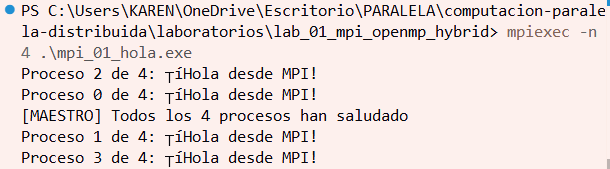

### Silvana — 2 procesos:

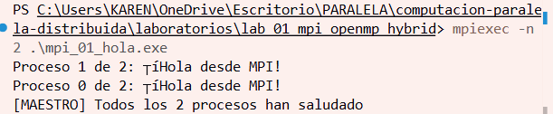

### Yeferson — 4 procesos:

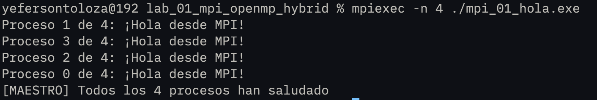

### Yeferson — 2 procesos:

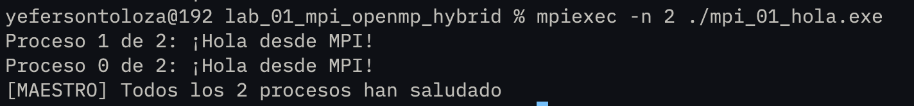

**Respuestas a las preguntas de análisis:**

1. **¿Por qué el orden de salida varía entre ejecuciones?**
   El orden varía porque cada proceso corre de forma independiente y en paralelo. El sistema operativo decide en qué momento le asigna tiempo de CPU a cada uno, por esto no se garantiza de en qué orden llegan los `printf()` al de salida. Esto es una característica del paralelismo, no un error.

2. **¿Qué pasaría si ejecutas con `-n 1`?**
   Solo existiría un proceso (rank=0, size=1). El programa funciona correctamente pero sin paralelismo real: imprime una sola línea de saludo y el mensaje del maestro. No tiene sentido paralelizar con un único proceso ya que no hay trabajo distribuido.

3. **¿Para qué sirve `MPI_COMM_WORLD`?**
   Es el comunicador por defecto que agrupa a todos los procesos del programa. Funciona como un "canal de comunicación" que conecta a todos. Sí pueden existir otros comunicadores personalizados (usando `MPI_Comm_split` o `MPI_Comm_create`) para crear subgrupos de procesos que se comuniquen entre sí de forma independiente.

---

## Ejercicio 2 — OpenMP dentro de MPI

**Descripción:** Dentro de cada proceso MPI se lanza una región paralela OpenMP con 4 hilos. Cada hilo imprime su ID junto con el rank del proceso que lo contiene, implementando el modelo de programación híbrida MPI+OpenMP. Al final, el proceso maestro calcula el total de unidades de cómputo activas.

**Compilación y ejecución:**
```bash
mpicc -fopenmp mpi_02_hibrido.c -o mpi_02_hibrido.exe
mpiexec -n 2 .\mpi_02_hibrido.exe
mpiexec -n 4 .\mpi_02_hibrido.exe
```

### Silvana — 2 procesos MPI × 4 hilos:

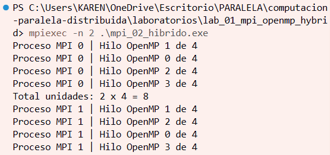

### Silvana — 4 procesos MPI × 4 hilos:

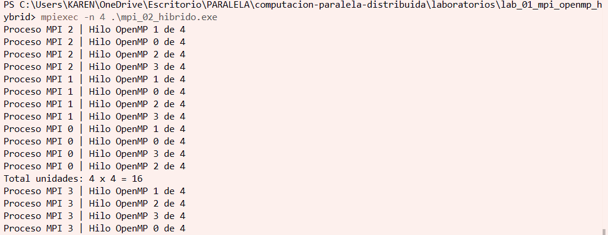

### Yeferson — 2 procesos MPI × 4 hilos:

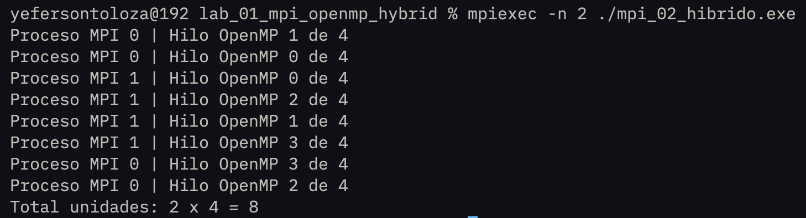

### Yeferson — 4 procesos MPI × 4 hilos:

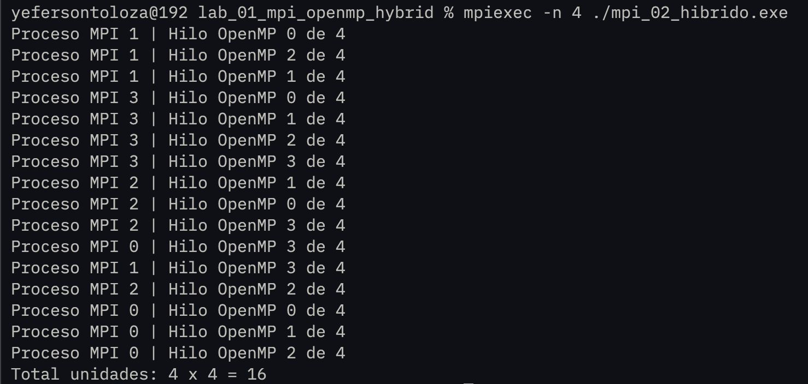

**Respuestas a las preguntas de análisis:**

1. **Con 2 procesos MPI y 4 hilos OMP, ¿cuántas unidades de cómputo hay en total?**
   Hay **8 unidades de cómputo** en total: 2 procesos MPI × 4 hilos OpenMP = 8. Cada proceso lanza 4 hilos que trabajan en paralelo dentro de él, sumando 8 unidades activas simultáneamente.

2. **¿En qué se diferencia ejecutar con `-n 4` (4 MPI, 4 hilos) vs `-n 1` (1 MPI, 16 hilos)?**
   Con `-n 4` hay 4 procesos MPI con memoria separada que se comunican, cada uno con 4 hilos: útil en múltiples nodos físicos. Con `-n 1` hay un solo proceso con 16 hilos que comparten la misma memoria: más eficiente en una sola máquina porque evita la sobrecarga de comunicación entre procesos. Ambas configuraciones tienen 16 unidades, pero la segunda es más rápida para un solo nodo (computador).

3. **¿Por qué `MPI_Init_thread` en lugar de `MPI_Init`?**
   Porque `MPI_Init` no garantiza que el entorno MPI sea seguro cuando hay múltiples hilos. `MPI_Init_thread` con el nivel `MPI_THREAD_FUNNELED` le indica explícitamente al sistema que solo el hilo maestro (thread 0) realizará llamadas MPI, evitando condiciones de carrera en las comunicaciones.

---

## Ejercicio 3 — Suma Híbrida de Vector

**Descripción:** El proceso maestro (rank 0) inicializa un vector de N=1,000,000 enteros donde `arr[i] = i`. Se distribuye entre los procesos con `MPI_Scatter`, cada proceso suma su porción usando OpenMP con `reduction`, y los resultados parciales se combinan con `MPI_Reduce` para obtener la suma total.

**Compilación y ejecución:**
```bash
mpicc -fopenmp mpi_03_suma_hibrida.c -o mpi_03.exe
mpiexec -n 4 .\mpi_03.exe
```

### Silvana — resultado:

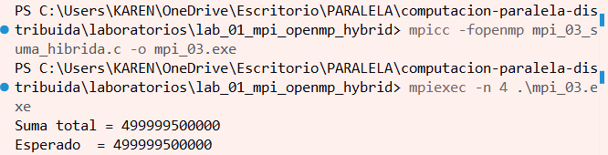

### Yeferson — resultado:

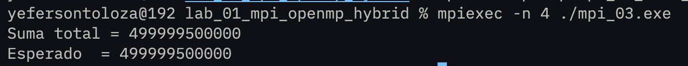

**Verificación:**
```
Suma total = 499999500000
Esperado   = 499999500000  ✓
```

**Respuestas a las preguntas de análisis:**

1. **¿Qué hace exactamente `MPI_Scatter`?**
   `MPI_Scatter` toma el arreglo completo que tiene el proceso 0, lo divide en bloques iguales de tamaño `chunk = N/size` y envía un bloque a cada proceso, incluyendo al propio proceso 0. Es una operación colectiva de distribución uno-a-todos: solo el proceso 0 tiene los datos originales y los reparte automáticamente entre todos.

2. **¿Por qué `reduction(+:suma_local)` y no una variable compartida directamente?**
   Porque si varios hilos escriben en la misma variable al mismo tiempo se produce una **condición de carrera**: dos hilos leen el valor, lo modifican y escriben, pero uno sobreescribe el trabajo del otro, dando un resultado incorrecto. La cláusula `reduction` crea una copia `suma_local` para cada hilo, cada uno acumula en la suya, y al final OpenMP las suma de forma segura en la variable original.

3. **¿Qué pasaría si olvidaras `MPI_Reduce` e imprimieras `suma_local` en rank 0?**
   El rank 0 solo imprimiría **su propia suma parcial**, es decir, la suma de los primeros 250,000 elementos (1/4 del total). El resultado sería `31249875000` en lugar de `499999500000`. Las sumas de los demás procesos nunca llegarían al rank 0 y se perderían.

---

## Ejercicio 4 (Reto) — Speedup Híbrido

**Descripción:** Se añade medición de tiempos con `MPI_Wtime()` al Ejercicio 3 para comparar el rendimiento entre la versión secuencial, MPI puro, OpenMP puro y la combinación híbrida MPI+OpenMP.

**Compilación:**
```bash
mpicc -fopenmp mpi_04_speedup.c -o mpi_04.exe
```

**Tabla de resultados:**

| Configuración | Procesos MPI | Hilos OMP | Speedup Silvana | Speedup Yeferson |
|---------------|:------------:|:---------:|:---------------:|:----------------:|
| Solo MPI      | 4            | 1         | 0.27×           | 0.15×            |
| Solo OMP      | 1            | 4         | 0.50×           | 0.21×            |
| MPI + OMP     | 2            | 2         | 0.51×           | 0.11×            |
| MPI + OMP     | 4            | 2         | 0.20×           | 0.08×            |

**Discusion de resultados**
En nuestros resultados, la configuración más eficiente fue diferente en cada computador. En caso de Silvana, la mejor fue MPI + OMP (2x2) con un speedup de 0.51×, mientras que en el computador de Yeferson la mejor fue Solo OMP con 0.21×. Creemos que esto pasó porque OpenMP aprovecha mejor la memoria compartida en una sola máquina y evita parte de la sobrecarga que introduce MPI al comunicar procesos. También vimos que usar demasiados procesos o hilos no siempre mejora el rendimiento, ya que aumenta la sincronización y el tiempo de comunicación.


**Comandos para cada configuración:**
```bash
# Secuencial
set OMP_NUM_THREADS=1
mpiexec -n 1 .\mpi_04.exe

# Solo MPI (4 procesos, 1 hilo OMP)
set OMP_NUM_THREADS=1
mpiexec -n 4 .\mpi_04.exe

# Solo OMP (1 proceso, 4 hilos)
set OMP_NUM_THREADS=4
mpiexec -n 1 .\mpi_04.exe

# Híbrido 2x2
set OMP_NUM_THREADS=2
mpiexec -n 2 .\mpi_04.exe

# Híbrido 4x2
set OMP_NUM_THREADS=2
mpiexec -n 4 .\mpi_04.exe
```

### Silvana
**Solo MPI (4 procesos, 1 hilo) — Speedup: 0.27×:**

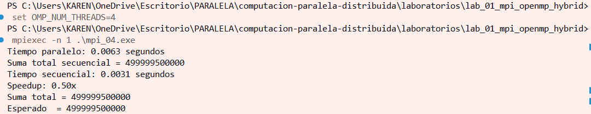

**Solo OMP (1 proceso, 4 hilos) — Speedup: 0.50×:**


**Híbrido 2×2 — Speedup: 0.51×:**

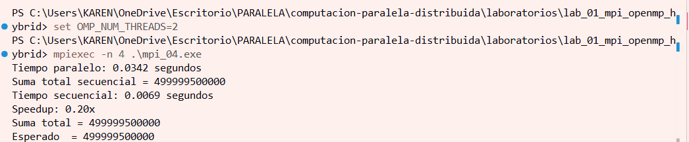

**Híbrido 4×2 — Speedup: 0.20×:**

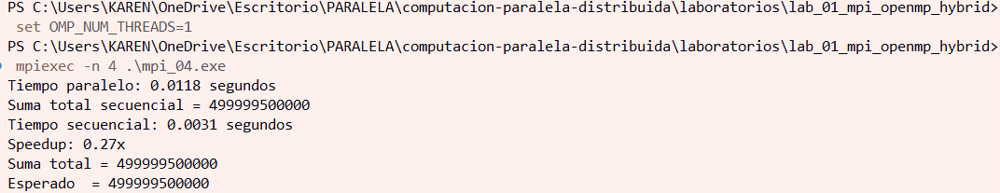

### Yeferson

**Solo MPI (4 procesos, 1 hilo) — Speedup: 0.15×:**

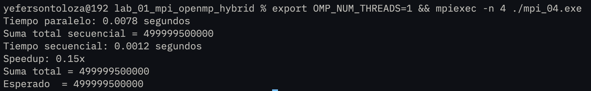

**Solo OMP (1 proceso, 4 hilos) — Speedup: 0.21×:**

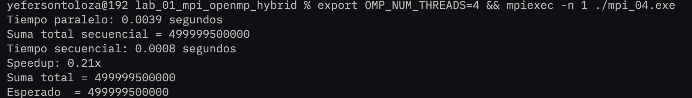

**Híbrido 2×2 — Speedup: 0.11×:**

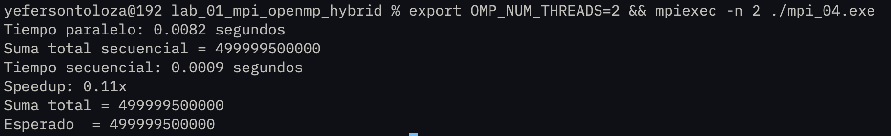

**Híbrido 4×2 — Speedup: 0.08×:**

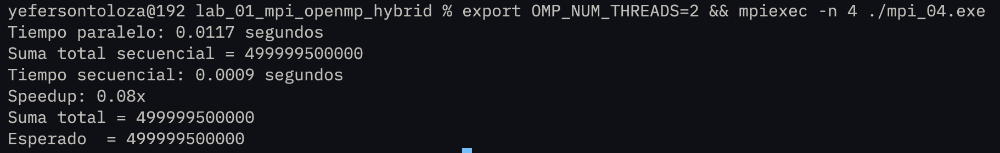

**Respuestas a las preguntas de análisis:**

1. **¿Coincide el speedup con lo que predice la Ley de Amdahl?**
   No completamente. La Ley de Amdahl dice que mientras mayor sea la parte paralelizable del programa, mayor debería ser el speedup. Sin embargo, en nuestros resultados el speedup fue menor al esperado porque no todo el tiempo se dedica al cálculo paralelo. También existe tiempo gastado en crear procesos e hilos, sincronizarlos y comunicar datos entre ellos, lo que reduce la ganancia real de rendimiento.

2. **¿Por qué más procesos/hilos no siempre dan mayor speedup?**
   Porque al aumentar procesos o hilos también aumentan los costos del sistema, ya que los procesos MPI necesitan comunicarse constantemente y los hilos OpenMP deben sincronizarse para evitar errores. Además, todos compiten por recursos como CPU, memoria y caché. Si el número de procesos o hilos es muy alto para el hardware disponible, la sobrecarga puede ser mayor que el beneficio del paralelismo, haciendo que el programa sea más lento.

3. **¿Qué overhead introduce MPI que no existe en OpenMP puro?**
   MPI introduce overhead de comunicación entre procesos, ya que cada proceso trabaja con memoria separada y necesita enviar y recibir datos con mensajes. Operaciones como MPI_Scatter y MPI_Reduce agregan tiempo extra de comunicación y sincronización. En cambio, OpenMP trabaja con hilos dentro del mismo proceso y todos comparten memoria, por lo que el acceso a los datos es más rápido y el costo de comunicación es mucho menor.

---

## Conclusiones

1. Durante el desarrollo del laboratorio logramos comprender cómo funcionan los modelos de programación paralela MPI y OpenMP, de forma individual y combinados en un modelo híbrido. Pudimos observar cómo MPI distribuye el trabajo entre procesos independientes y cómo OpenMP aprovecha el paralelismo mediante hilos dentro de un mismo proceso. Esto nos permitió entender mejor la diferencia entre memoria distribuida y memoria compartida, así como las ventajas y limitaciones que tiene cada enfoque.

2. Los resultados obtenidos demostraron que el paralelismo no siempre garantiza una mejora inmediata en el rendimiento. Aunque esperábamos speedups mayores, observamos que el overhead de comunicación, sincronización y administración de procesos puede afectar el tiempo de ejecución, especialmente en problemas pequeños o en computadores con recursos limitados. También comprobamos que aumentar la cantidad de procesos e hilos no siempre mejora el desempeño y que es importante encontrar una configuración adecuada según el hardware disponible.

3. Además del aprendizaje técnico, el laboratorio fortaleció nuestro trabajo colaborativo y el uso de herramientas de desarrollo como Git y GitHub. Aprendimos a organizar un repositorio, documentar correctamente los ejercicios, manejar capturas de resultados y trabajar de forma sincronizada mediante commits y actualizaciones del repositorio. Esto nos ayudó a desarrollar buenas prácticas para proyectos colaborativos y para la documentación de experimentos en programación concurrente y distribuida.
---

