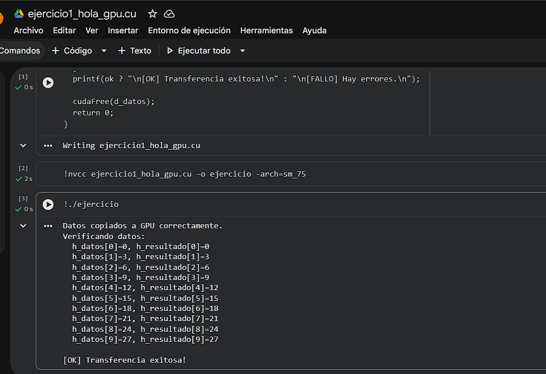

# Ejercicio 1 — Hola GPU: Mi primer programa CUDA

> **Categoría:** Básico — Transferencia de datos CPU → GPU → CPU
> **Autor:** Silvana

---

## Descripción

Programa que inicializa un arreglo de 10 enteros en la CPU (múltiplos de 3), lo copia a la memoria de la GPU y luego lo recupera de vuelta a la CPU. Verifica elemento por elemento que los datos llegaron intactos. El objetivo es comprobar que el flujo de transferencia `cudaMemcpy` funciona correctamente antes de escribir kernels.

---

## Compilación y ejecución

```bash
nvcc ejercicio1_hola_gpu.cu -o ejercicio1
./ejercicio1        # Linux / Google Colab
.\ejercicio1.exe    # Windows
```

---

## Evidencia

**Compilación y ejecución:**



---

## Tarea — Preguntas de reflexión

**¿Qué pasaría si olvidaras liberar la memoria con `cudaFree`?**

Si se omite `cudaFree`, la memoria reservada en la GPU queda ocupada hasta que el programa termine. En programas cortos el sistema operativo la libera al finalizar, pero en aplicaciones largas o bucles que reservan memoria repetidamente esto genera una fuga de memoria en la VRAM. La GPU tiene memoria limitada, por lo que acumular fugas puede hacer que futuras llamadas a `cudaMalloc` fallen con error `cudaErrorMemoryAllocation`.