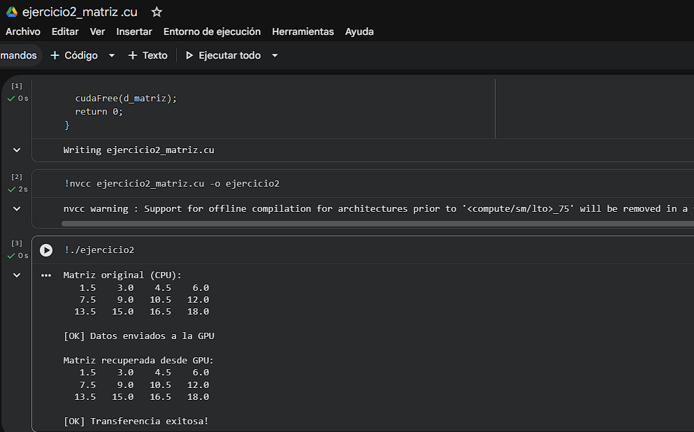

# Ejercicio 2 — Copia de Matriz 2D CPU ↔ GPU

> **Categoría:** Básico — Transferencia 2D
> **Autor:** Yeferson

---

## Descripción

Transfiere una matriz de 3×4 floats entre CPU y GPU. La GPU no realiza ningún cálculo, solo almacena temporalmente los datos. El programa imprime la matriz original y la recuperada para verificar que la transferencia fue exacta. Enseña a calcular correctamente el tamaño en bytes para estructuras multidimensionales representadas como arreglos planos 1D.

---

## Compilación y ejecución

```bash
nvcc ejercicio2_matriz.cu -o ejercicio2
./ejercicio2        # Linux / Google Colab
.\ejercicio2.exe    # Windows
```

---

## Evidencia

**Compilación y ejecución:**



---

## Tarea — Preguntas de reflexión

**Modifica el programa para verificar automáticamente que cada elemento de `h_original == h_recuperada`.**

Se agrega al final del `main` un bucle que compara cada par de elementos usando `fabsf(a - b) < 1e-5f` para tolerar errores de punto flotante:

```c
int ok = 1;
for (int i = 0; i < N; i++) {
    if (fabsf(h_original[i] - h_recuperada[i]) > 1e-5f) {
        printf("[ERROR] Diferencia en índice %d: %.4f vs %.4f\n",
               i, h_original[i], h_recuperada[i]);
        ok = 0;
    }
}
if (ok) printf("\n[OK] Todos los elementos coinciden.\n");
```

La comparación directa `==` entre floats es peligrosa porque las operaciones de punto flotante pueden introducir pequeñas diferencias numéricas. `fabsf` calcula el valor absoluto de la diferencia para verificar que está dentro de una tolerancia aceptable.
