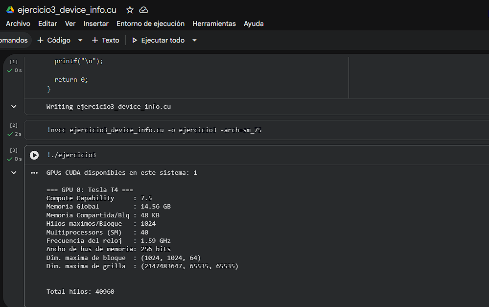
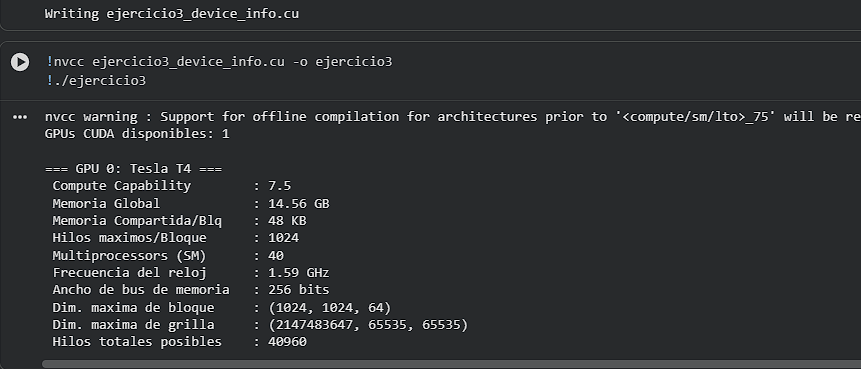

# Ejercicio 3 — Información del Device: Conoce tu GPU

> **Categoría:** Básico — Consulta de propiedades del Device
> **Autor:** Silvana

---

## Descripción

El programa consite en que consulta e imprime las propiedades de la GPU disponible en el sistema usando `cudaGetDeviceProperties`. Muestra nombre, capacidad de cómputo, memoria global, memoria compartida por bloque, hilos máximos por bloque, número de Streaming Multiprocessors, frecuencia de reloj y dimensiones máximas de bloque y grilla. Es fundamental conocer las características antes de optimizar cualquier kernel.

---

## Compilación y ejecución

```bash
nvcc ejercicio3_device_info.cu -o ejercicio3
./ejercicio3        # Linux / Google Colab
.\ejercicio3.exe    # Windows
```

---

## Evidencia

**Compilación y ejecución:**



---

## Tarea — Preguntas de reflexión

**Calcula e imprime cuántos hilos en total puede lanzar esta GPU.**

```c
printf(" Hilos totales posibles : %d\n",
       prop.multiProcessorCount * prop.maxThreadsPerMultiProcessor);
```
El total de hilos simultáneos que puede ejecutar una GPU es el producto del número de Streaming Multiprocessors (multiProcessorCount) por el máximo de hilos que puede manejar cada SM (maxThreadsPerMultiProcessor). En la Tesla T4 usada en este laboratorio el resultado es:

**40 SM × 1024 hilos/SM = 40,960 hilos simultáneos**

**Compilación y ejecución:**



---
Este número representa la capacidad máxima de paralelismo real de la GPU, que es distinta que el límite de hilos por bloque (maxThreadsPerBlock = 1024). Es decir, la Tesla T4 puede tener hasta 40 bloques completamente ocupados ejecutándose al mismo tiempo, uno por cada SM.
