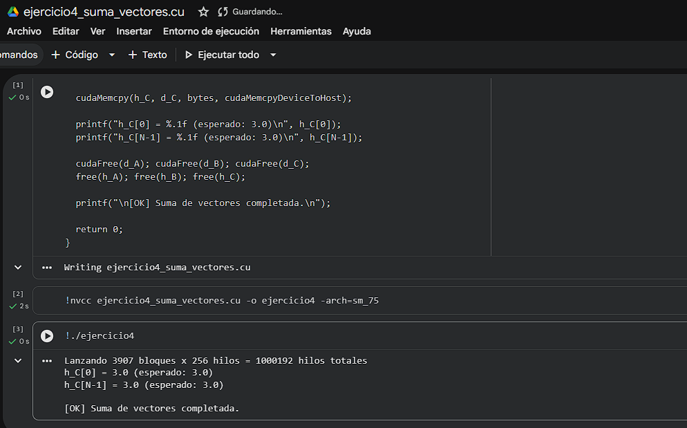

# Ejercicio 4 — Suma de Vectores Paralela

> **Categoría:** Kernels Básicos GPU
> **Autor:** Yeferson

---

## Descripción

El "Hola Mundo" clásico de CUDA. Suma dos vectores de N=1,000,000 elementos en la GPU: cada hilo calcula `C[i] = A[i] + B[i]` de forma independiente. El kernel usa la fórmula `idx = blockIdx.x * blockDim.x + threadIdx.x` para que cada hilo identifique qué elemento le corresponde procesar. Incluye un guard `if (idx < n)` para evitar accesos fuera de los límites del arreglo. El resultado se verifica contra el esperado (3.0) en CPU.

---

## Compilación y ejecución

```bash
nvcc ejercicio4_suma_vectores.cu -o ejercicio4
./ejercicio4        # Linux / Google Colab
.\ejercicio4.exe    # Windows
```

---

## Evidencia

**Compilación y ejecución:**



---

## Tarea — Preguntas de reflexión

**¿Por qué es necesario el guard `if (idx < n)`?**

Cuando `N` no es divisible exactamente por `THREADS_POR_BLOQUE`, el último bloque lanza más hilos de los necesarios. Por ejemplo, con N=1,000,000 y 256 hilos por bloque se lanzan 3,907 bloques × 256 = 1,000,192 hilos, pero solo 1,000,000 corresponden a datos reales. Sin el guard, los 192 hilos sobrantes accederían a posiciones de memoria fuera del arreglo, causando comportamiento indefinido o errores de acceso a memoria.
