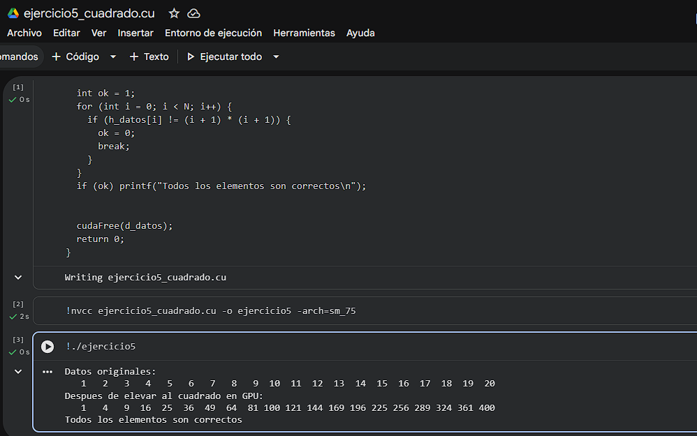
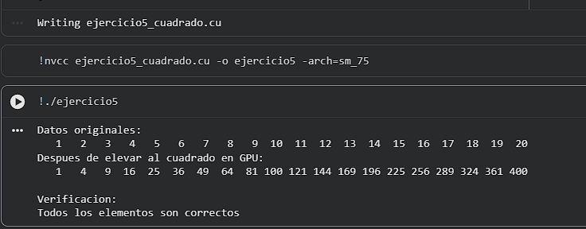

# Ejercicio 5 — Cuadrado de Elementos In-place

> **Categoría:** Kernels Básicos GPU
> **Autor:** Silvana

---

## Descripción

Kernel que eleva al cuadrado cada elemento de un arreglo directamente en la GPU de forma in-place: el resultado sobreescribe el arreglo de entrada sin necesidad de un arreglo auxiliar de salida. El arreglo se inicializa con valores del 1 al 20 en la CPU, se procesa en GPU con un único bloque de 20 hilos, y el resultado se verifica en CPU. Comprueba que un mismo puntero puede usarse como entrada y salida cuando no hay dependencias entre elementos.

---

## Compilación y ejecución

```bash
nvcc ejercicio5_cuadrado.cu -o ejercicio5
./ejercicio5        # Linux / Google Colab
.\ejercicio5.exe    # Windows
```

---

## Evidencia

**Compilación y ejecución:**



---

## Tarea — Preguntas de reflexión

**Verifica que cada elemento es igual a `(i+1)²` e imprime si hay algún error.**

```c
printf("\nVerificacion:\n");
int ok = 1;
for (int i = 0; i < N; i++) {
    int esperado = (i + 1) * (i + 1);
    if (h_datos[i] != esperado) {
        printf("[ERROR] h_datos[%d] = %d, esperado %d\n", i, h_datos[i], esperado);
        ok = 0;
    }
}
if (ok) printf("[OK] Todos los elementos son correctos.\n");
```

**Compilación y ejecución:**



---

El in-place funciona correctamente aquí porque cada hilo lee y escribe su propio elemento independiente: no hay dependencia de datos entre hilos, por lo que no se necesita sincronización ni un buffer temporal.
