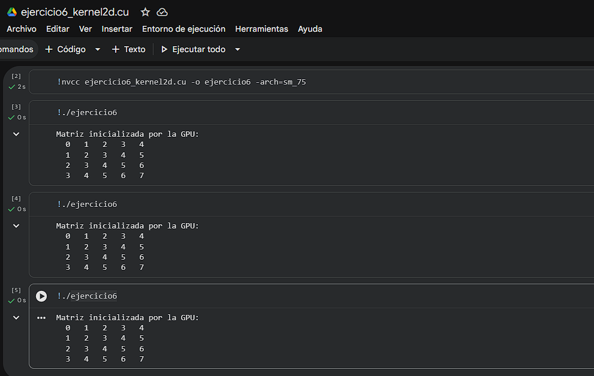

# Ejercicio 6 — Kernel 2D: Inicialización de Matriz

> **Categoría:** Kernels Básicos GPU — 2D
> **Autor:** Yeferson

---

## Descripción

Usa un kernel con bloques e hilos bidimensionales (`dim3`) para inicializar una matriz 4×5 en la GPU, donde cada elemento recibe su índice lineal como valor: `mat[i][j] = i * COLS + j`. Cada hilo calcula su fila y columna a partir de `blockIdx` y `threadIdx` en 2D, convierte el índice 2D a 1D y escribe en la posición correspondiente. El resultado se copia a CPU y se imprime para verificar.

---

## Compilación y ejecución

```bash
nvcc ejercicio6_kernel2d.cu -o ejercicio6
./ejercicio6        # Linux / Google Colab
.\ejercicio6.exe    # Windows
```

---

## Evidencia

**Compilación y ejecución:**



---

## Tarea — Preguntas de reflexión

**Modifica el kernel para que `mat[i][j] = i + j` en vez del índice lineal.**

Solo cambia la línea de asignación en el kernel:

```c
// Antes:
d_mat[idx] = idx;

// Después:
d_mat[idx] = fila + col;
```

Con esta modificación la matriz resultante tiene en cada celda la suma de su fila y columna. Por ejemplo, `mat[0][0] = 0`, `mat[1][2] = 3`, `mat[3][4] = 7`. El índice lineal `idx` sigue siendo necesario para direccionar correctamente la memoria, pero el valor almacenado cambia.
