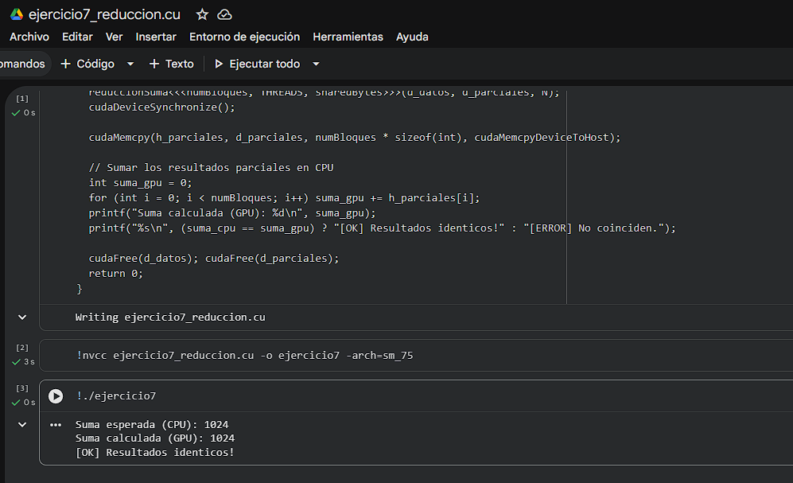

# Ejercicio 7 — Reducción Paralela: Suma de Arreglo con Shared Memory

> **Categoría:** Intermedio — Shared Memory y Reducción
> **Autor:** Silvana

---

## Descripción

Implementa la suma de todos los elementos de un arreglo de N=1,024 enteros usando reducción paralela con shared memory. En cada paso de la reducción, la mitad de los hilos suman su elemento con el del hilo simétrico opuesto, reduciendo el problema a la mitad en cada iteración. La shared memory (`extern __shared__`) permite que los hilos del mismo bloque intercambien datos con latencia mínima. `__syncthreads()` garantiza que todos los hilos hayan escrito antes de que los demás lean. El hilo 0 de cada bloque escribe el resultado parcial en memoria global, y la CPU suma los parciales.

---

## Compilación y ejecución

```bash
nvcc ejercicio7_reduccion.cu -o ejercicio7
./ejercicio7        # Linux / Google Colab
.\ejercicio7.exe    # Windows
```

---

## Evidencia

**Compilación y ejecución:**



---

## Tarea — Preguntas de reflexión

**¿Por qué `__syncthreads()` es crucial en este kernel?**

La reducción funciona en múltiples pasos: en cada iteración, el hilo `tid` lee `s_datos[tid + stride]`, que fue escrito por otro hilo en el paso anterior. Sin `__syncthreads()`, un hilo rápido podría avanzar al siguiente paso y sobreescribir, antes de que un hilo lento lo haya leído, produciendo resultados incorrectos. `__syncthreads()` es una barrera de sincronización que detiene a todos los hilos del bloque hasta que el último llegue a ese punto, garantizando que todos los datos estén escritos antes de cualquier lectura del siguiente paso.
