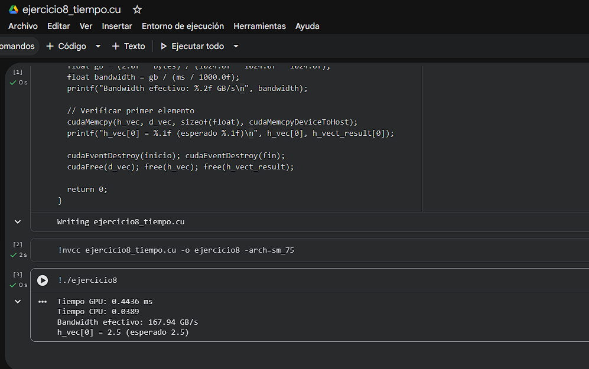

# Ejercicio 8 — Multiplicación Escalar y Medición de Tiempo

> **Categoría:** Intermedio — Rendimiento y Eventos CUDA
> **Autor:** Yeferson

---

## Descripción

Multiplica cada elemento de un vector de 10,000,000 floats por un escalar (2.5f) en la GPU. Mide el tiempo de ejecución del kernel usando CUDA Events (`cudaEventRecord`, `cudaEventElapsedTime`), que es la forma correcta de medir tiempo en GPU con precisión de microsegundos. Calcula el ancho de banda de memoria efectivo en GB/s: como el kernel lee y escribe cada elemento, el tráfico total es `2 * N * sizeof(float)` bytes. Permite comparar el rendimiento real del hardware contra su ancho de banda teórico máximo.

---

## Compilación y ejecución

```bash
nvcc ejercicio8_tiempo.cu -o ejercicio8
./ejercicio8        # Linux / Google Colab
.\ejercicio8.exe    # Windows
```

---

## Evidencia

**Compilación y ejecución:**



---

## Tarea — Preguntas de reflexión

**Implementa la misma operación en CPU con `clock()` y compara los tiempos.**

```c
// Después del bloque GPU, agregar:
clock_t cpu_inicio = clock();
for (int i = 0; i < N; i++) h_vec[i] *= escalar;
clock_t cpu_fin = clock();
double ms_cpu = 1000.0 * (cpu_fin - cpu_inicio) / CLOCKS_PER_SEC;
printf("Tiempo CPU: %.4f ms\n", ms_cpu);
printf("Speedup GPU vs CPU: %.2fx\n", ms_cpu / ms);
```

En la práctica, la GPU suele ser entre 5× y 50× más rápida que la CPU para este tipo de operación de memoria-intensiva, dependiendo del hardware. El cuello de botella de este kernel es el ancho de banda de memoria (memory-bound), no la capacidad de cómputo, ya que solo hace una multiplicación por elemento leído.
