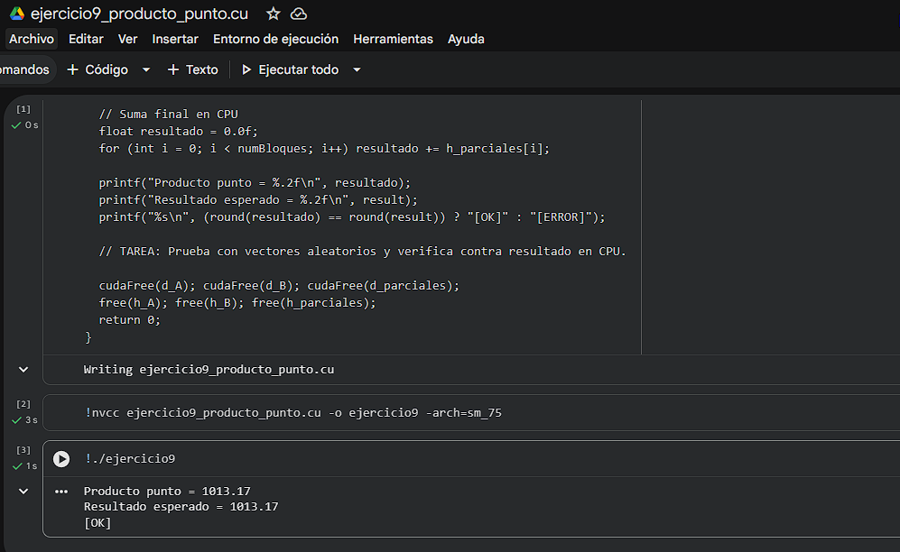
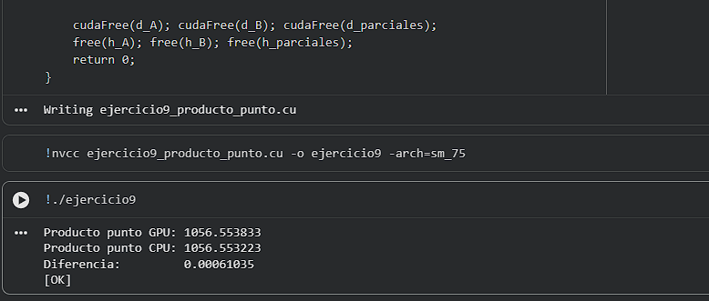

# Ejercicio 9 — Producto Punto de Vectores

> **Categoría:** Intermedio — Combinación de patrones
> **Autor:** Silvana

---

## Descripción

Calcula el producto punto (dot product) de dos vectores de N=4,096 elementos: `resultado = Σ A[i] * B[i]`. Combina dos patrones: multiplicación elemento a elemento en la GPU y reducción paralela con shared memory por bloque. Cada hilo calcula su contribución `A[idx] * B[idx]` y la carga en shared memory; luego el bloque reduce su porción hasta obtener una suma parcial, que el hilo 0 escribe en memoria global. La suma final de los parciales se hace en CPU. Con ambos vectores inicializados a 1.0f, el resultado esperado es exactamente N.

---

## Compilación y ejecución

```bash
nvcc ejercicio9_producto_punto.cu -o ejercicio9
./ejercicio9        # Linux / Google Colab
.\ejercicio9.exe    # Windows
```

---

## Evidencia

**Compilación y ejecución:**



---

## Tarea — Preguntas de reflexión

**Prueba con vectores aleatorios y verifica contra el resultado en CPU.**

```c
// Inicialización con valores aleatorios:
srand(42);
for (int i = 0; i < N; i++) {
    h_A[i] = (float)rand() / RAND_MAX;
    h_B[i] = (float)rand() / RAND_MAX;
}

// Verificación en CPU:
float resultado_cpu = 0.0f;
for (int i = 0; i < N; i++) resultado_cpu += h_A[i] * h_B[i];
printf("Producto punto GPU: %.6f\n", resultado);
printf("Producto punto CPU: %.6f\n", resultado_cpu);
printf("Diferencia: %.8f\n", fabsf(resultado - resultado_cpu));
printf("%s\n", fabsf(resultado - resultado_cpu) < 1e-2f ? "[OK]" : "[ERROR]");
```

**Compilación y ejecución:**



---
Con vectores de punto flotante aleatorios es normal que haya pequeñas diferencias entre GPU y CPU por el orden de las sumas (el orden de las operaciones de punto flotante afecta el resultado). Por eso se usa una tolerancia (`1e-2f`) en vez de comparación exacta.
