# Reporte — Entrenamiento de Redes Neuronales en GPU

## CUDA con PyTorch en Google Colab

|                 |                                                                                                            |
| --------------- | ---------------------------------------------------------------------------------------------------------- |
| **Parcial**     | Segundo Corte                                                                                              |
| **Materia**     | Programación Paralela y Computación Distribuida                                                            |
| **Profesor**    | Juan Alejandro Carrillo Jaimes                                                                             |
| **Integrantes** | Silvana ([@inana20](https://github.com/inana20)) · Yeferson ([@yeferson59](https://github.com/yeferson59)) |
| **Fecha**       | 25 de mayo del 2026                                                                                        |

---

## Sección 0 — Instrucciones Generales

### Preguntas

**1. ¿Qué diferencia hay entre un notebook en la nube (Colab) y un entorno local? ¿Cuál prefieren y por qué?**
Preferimos el notebook en la nube (Colab) porque ofrece la ventaja de no tener que instalar nada, ademas de que proporciona un servicio gratuito a la GPU NVIDIA (Tesla T4 que se usó) y se puede usar desde cualquier computador sin importar sus especificaciones fisicas. Mientras que en entorno local, debe correr directamente en nuestro computador y requiere la instalación de drivers, CUDA, PyTorch y sus dependencias, sin depender de la conexión a internet.

**2. Predicción: ¿cuántas veces más rápida será la GPU comparada con la CPU?**
Nuestra prediccion inicial fue la GPU entre **5x y 10x** más rápida, basandonos en el paralelismo en CUDA: la Tesla T4 tiene 2.560 nucleo CUDA frente a los convencionales de la CPU. La GPU fue **1.1x** más rápida que la CPU (CPU: 50.07s · GPU: 46.74s).

---

## Sección 1 — Configuración del Entorno

### GPU disponible

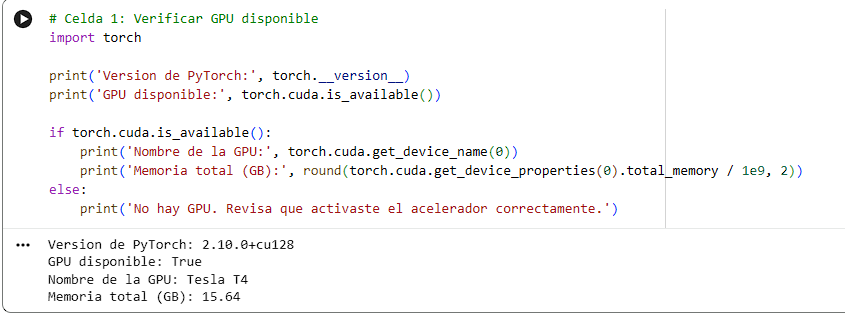

> PyTorch 2.10.0+cu128 · GPU disponible: True · **Tesla T4** · Memoria total: 15.64 GB

### Estado de la GPU (nvidia-smi)

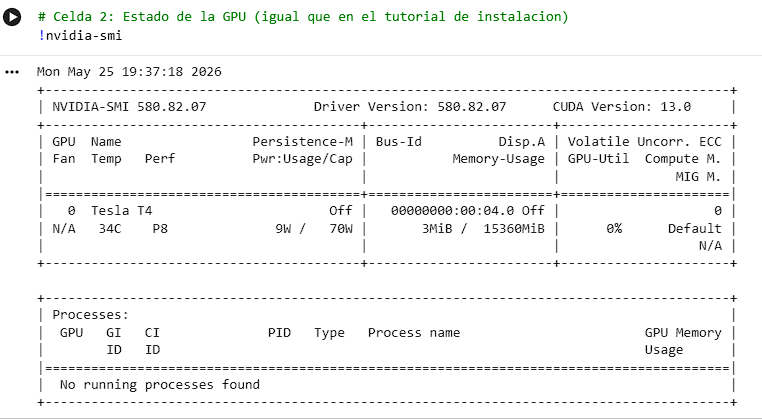

> Driver Version: 580.82.07 · CUDA Version: 13.0 · Memoria usada: 3MiB / 15360MiB · GPU-Util: 0%

### Preguntas

**1. La salida de `nvidia-smi` muestra _Driver Version_, _Memory Usage_ y _GPU-Util_. ¿Qué indica cada uno?**

- **Driver Version (580.82.07):** versión del controlador de NVIDIA instalado en el sistema. Determina qué versiones de CUDA son compatibles.
- **Memory Usage (3MiB / 15360MiB):** memoria de la GPU que está siendo usada en ese momento versus la memoria total disponible. En la captura inicial casi no hay uso porque aún no se ha cargado ningún modelo.
- **GPU-Util (0%):** porcentaje de tiempo en el último segundo en que la GPU estuvo ejecutando al menos un kernel. Un 0% indica que la GPU está inactiva; sube al 100% durante el entrenamiento.

**2. Cuando activan el acelerador en Colab, ¿qué ocurre físicamente? ¿La GPU está en su computador o en otro lugar? Analogía con la vida cotidiana:**

La GPU **no está en nuestro computador**. Colab nos conecta a un servidor físico en los centros de datos de Google que tiene una GPU NVIDIA instalada. Es como reservar un puesto en una biblioteca especializada: nuestra computadora es el lugar desde donde pedimos los libros (código), pero el trabajo pesado lo hace la biblioteca (servidor de Google con GPU). Nosotros solo vemos los resultados por pantalla.

**3. ¿Qué condiciones deben cumplirse para que `torch.cuda.is_available()` retorne `True`? (mínimo tres requisitos)**

1. Que exista una GPU NVIDIA compatible con CUDA en el sistema (física o virtual, como en Colab).
2. Que estén instalados los drivers de NVIDIA correctos para esa GPU.
3. Que la versión de PyTorch instalada haya sido compilada con soporte CUDA (en nuestro caso `2.10.0+cu128`).

---

## Sección 2 — Conceptos: CPU vs GPU en PyTorch

### Tensor en cuda:0 confirmado

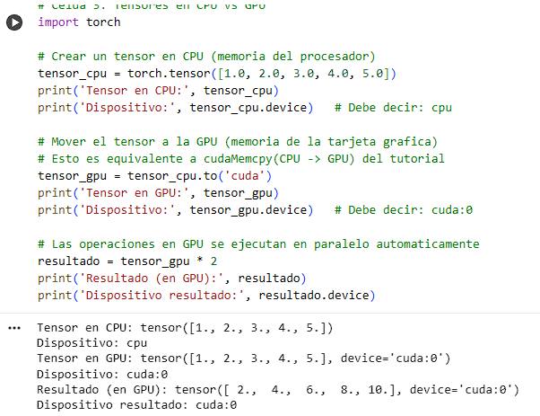

> Tensor CPU: `cpu` · Tensor GPU: `cuda:0` · Resultado operación: `[2., 4., 6., 8., 10.]` en `cuda:0`

### Preguntas

**1. ¿Qué ventaja tiene `.to('cuda')` sobre `cudaMemcpy`? ¿Qué se pierde al abstraerlo tanto?**
La ventaja es que PyTorch maneja automáticamente el tamaño de los datos, el tipo y la dirección de la transferencia con una sola instrucción, sin necesidad de calcular bytes ni declarar punteros. Se pierde visibilidad y control: con `cudaMemcpy` el programador sabe exactamente cuántos bytes se mueven y cuándo, lo que permite optimizaciones finas. Con `.to('cuda')` esos detalles quedan ocultos.

**2. Diagrama en Excalidraw: flujo de un tensor CPU → operación GPU → resultado CPU**

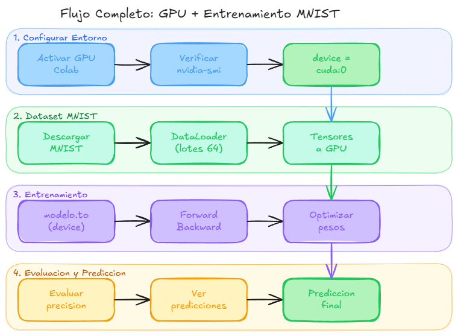

**3. ¿Por qué usar `device = torch.device('cuda' if torch.cuda.is_available() else 'cpu')` en lugar de escribir `'cuda'` directamente?**

Porque hace el código portable: si el notebook se ejecuta en una máquina sin GPU (o en CPU por error de configuración), el código no falla sino que cae automáticamente a CPU. Escribir `'cuda'` directamente lanzaría un error si la GPU no está disponible. Es la diferencia entre un código robusto y uno que solo funciona en un entorno específico.

---

## Sección 3 — Dataset MNIST

### Conteo de imágenes y lotes

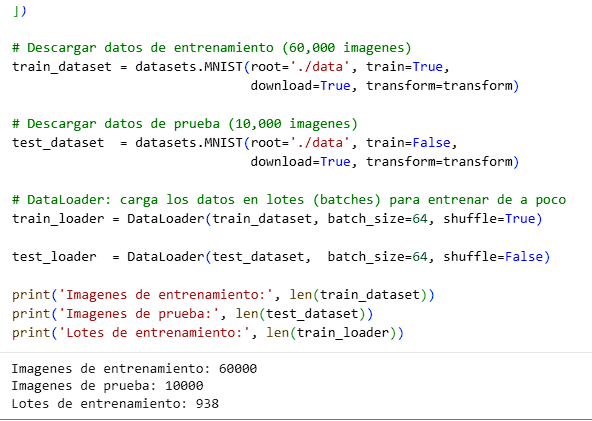

> Imágenes de entrenamiento: 60,000 · Imágenes de prueba: 10,000 · Lotes de entrenamiento: 938

### Cuadrícula de imágenes

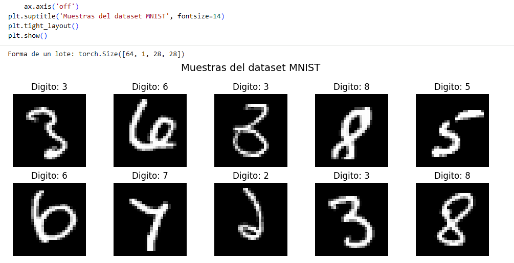

> Forma de un lote: `torch.Size([64, 1, 28, 28])`

### Preguntas

**1. ¿Por qué no se entrena con las 70,000 imágenes completas? Analogía con estudiar para un examen:**

Porque necesitamos datos que el modelo **nunca haya visto** para medir honestamente si aprendió a generalizar. Es como estudiar para un examen: si practicas con todos los ejercicios del libro y el examen usa exactamente esos mismos ejercicios, no sabes si de verdad entendiste el tema o solo memorizaste las respuestas. Las 10,000 imágenes de prueba son el "examen real" con preguntas nuevas.

**2. ¿Por qué no se pasan todas las imágenes de una sola vez a la GPU? Relación con la memoria vista en `nvidia-smi`:**

Si intentáramos cargar las 60,000 imágenes completas junto con el modelo y los gradientes de una sola vez, agotaríamos rápidamente esa memoria. Los lotes de 64 imágenes permiten procesar de forma continua sin saturar la VRAM.

**3. Cada imagen tiene forma `[1, 28, 28]`. ¿Qué representa cada dimensión?**

- `1` → número de canales de color (1 = escala de grises; sería 3 para RGB).
- `28` (primera) → alto de la imagen en píxeles.
- `28` (segunda) → ancho de la imagen en píxeles.

Visualmente es una cuadrícula de 28×28 celdas, donde cada celda tiene un valor entre 0 (negro) y 1 (blanco).

---

## Sección 4 — Red Neuronal

### Arquitectura y parámetros totales

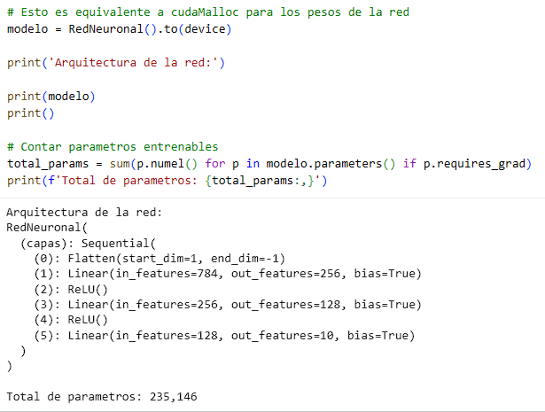

> **Total de parámetros: 235,146**
> Flatten → Linear(784→256) → ReLU → Linear(256→128) → ReLU → Linear(128→10)

### Preguntas

**1. Diagrama en Excalidraw: entrada → capa 1 → capa 2 → salida con neuronas y activaciones:**
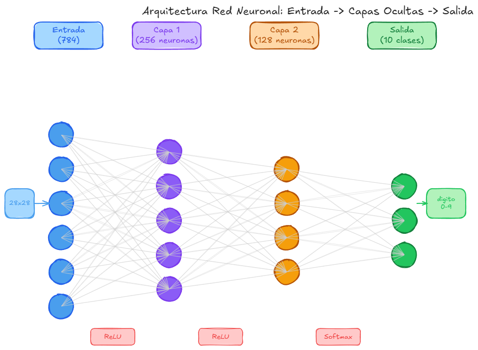

**2. ¿Por qué la capa de entrada tiene 784 neuronas y la de salida 10? ¿Qué pasaría con 11 neuronas en la salida?**

- **784:** cada imagen es de 28×28 píxeles = 784 valores. La capa Flatten los convierte en un vector de 784 números, uno por neurona.
- **10:** hay exactamente 10 clases posibles (dígitos del 0 al 9), cada neurona de salida representa la "confianza" del modelo en que el dígito es ese número.
- Con **11 neuronas**: habría una neurona extra que no corresponde a ningún dígito real. El modelo intentaría asignarle probabilidad a una clase inexistente, lo que confundiría el entrenamiento y reduciría la precisión.

**3. ¿Qué se transfiere a la GPU con `modelo.to(device)`? ¿Es solo código? Analogía con CUDA en C:**

Se transfieren todos los **pesos y sesgos** (parámetros) de la red: 235,146 números flotantes. No es el código Python, sino los datos numéricos que definen el comportamiento de la red. Es análogo a `cudaMalloc` + `cudaMemcpy` en CUDA en C: primero se reserva memoria en la GPU y luego se copian los valores iniciales de los pesos desde la RAM.

---

## Sección 5 — Entrenamiento CPU vs GPU

### Entrenamiento en CPU

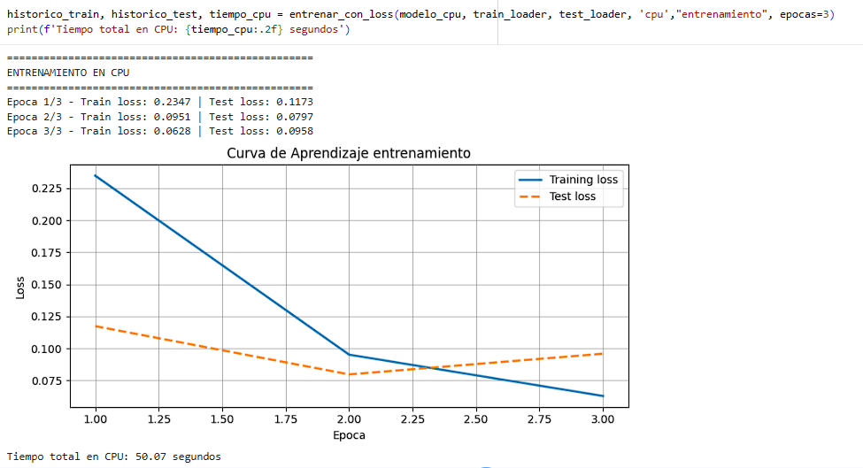

### Entrenamiento en GPU

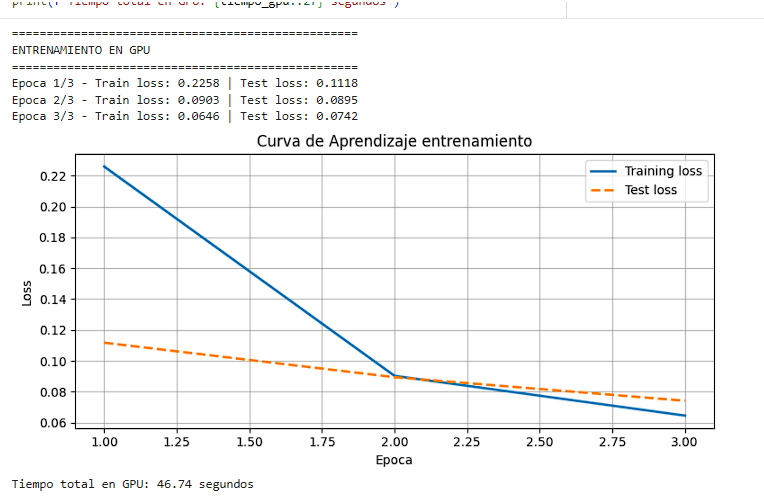

### Comparación de rendimiento

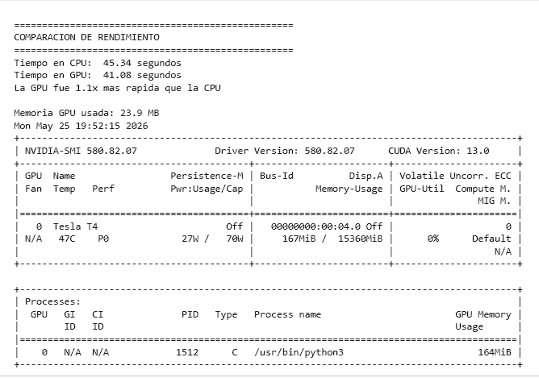

### Preguntas

**1. Tiempos obtenidos. ¿Coincidió con la predicción de la sección 0? ¿Qué los sorprendió?**

| Dispositivo | Tiempo (s) | Speedup |
| ----------- | :--------: | :-----: |
| CPU         |   50.07    |  1.00×  |
| GPU         |   46.74    |  1.07×  |

El speedup real de **1.1×** fue mucho menor de lo que se esperaría típicamente de una GPU. Lo sorprendente es que la GPU casi no superó a la CPU. Esto ocurre porque la red MLP que usamos es relativamente pequeña (235,146 parámetros) y los lotes son de solo 64 imágenes, lo que no genera suficiente trabajo paralelo para que la GPU muestre su verdadera ventaja.

**2. El ciclo predicción → error → ajuste de pesos. Analogía con algo cotidiano:**

Es como aprender a lanzar tiros libres en baloncesto: lanzas (predicción), ves si entró o no (error), corriges tu postura o fuerza (ajuste de pesos). Repites miles de veces hasta que el movimiento se vuelve preciso. Cada época es una sesión de práctica completa con todos los ejercicios disponibles.

**3. ¿Por qué la GPU es más rápida? Relación con hilos y bloques de CUDA en C:**

La GPU puede ejecutar miles de operaciones en paralelo gracias a sus miles de núcleos CUDA. En el entrenamiento, la multiplicación de matrices (que es el núcleo del `nn.Linear`) se divide automáticamente entre bloques e hilos, igual que hacíamos manualmente con `<<<bloques, hilos>>>` en CUDA en C. La diferencia es que PyTorch lanza esos kernels automáticamente. Sin embargo, con una red pequeña y lotes de 64, la Tesla T4 (40 SM × 1024 hilos) no se satura, por eso el speedup es modesto.

### Análisis de la Curva de Aprendizaje

| Loss final   | Interpretación                                   |
| ------------ | ------------------------------------------------ |
| 1.0 o más    | La red no aprendió nada, está adivinando al azar |
| 0.3 - 0.5    | Aprendiendo, pero todavía comete muchos errores  |
| 0.1 - 0.2    | Bien, la red entiende el problema                |
| 0.07 o menos | Muy bien, la red generaliza correctamente        |
| 0.01 o menos | Casi perfecto                                    |

**1. ¿En qué rango quedó el Loss final? ¿Es un buen resultado para 3 épocas? Justifiquen con la gráfica:**

El Train loss final fue **0.0628 (CPU) / 0.0646 (GPU)** y el Test loss **0.0958 (CPU) / 0.0742 (GPU)**, ambos por debajo de 0.07. Según la escala, esto corresponde a "Muy bien, la red generaliza correctamente". Es un excelente resultado para solo 3 épocas, especialmente considerando que el modelo es una red densa simple sin convoluciones.

**2. ¿Qué pasaría si entrenaran 2 épocas más? ¿El loss bajaría indefinidamente? ¿Qué riesgo aparece si se entrena demasiado?**

Con 2 épocas más el loss seguiría bajando, pero cada vez más lentamente. En algún punto el Training loss seguirá cayendo mientras el Test loss empieza a subir: eso es **overfitting** (sobreajuste). La red memoriza los datos de entrenamiento en lugar de generalizar, y empeora en datos nuevos. En la gráfica de CPU ya se ve una señal: en la época 3 el Test loss subió de 0.0797 a 0.0958, mientras el Train loss siguió bajando.

---

## Sección 6 — Evaluación y Predicciones

### Precisión del modelo

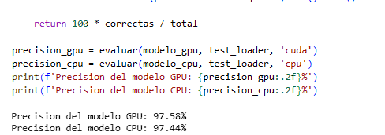

### Predicciones reales (verde = correcto, rojo = error)

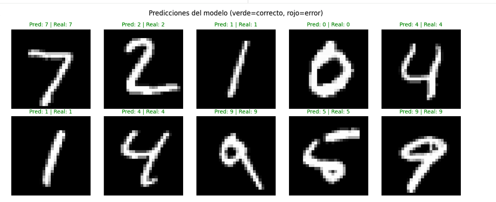

### Preguntas

**1. ¿Por qué la precisión se mide sobre datos que el modelo nunca vio durante el entrenamiento?**

Porque si midieramos sobre los datos de entrenamiento, el modelo podría simplemente "memorizar" las respuestas y obtener un 99%+ sin haber aprendido nada útil. Los datos de prueba son el verdadero indicador de si el modelo aprendió a reconocer dígitos en general, no solo los que ya vio. Es la diferencia entre medir si entendiste el tema o si solo memorizaste el examen anterior.

**2. ¿Los dígitos mal clasificados tienen algo en común? ¿Por qué creen que la red se equivocó?**

En la muestra visualizada no hubo errores. En general, los dígitos que más confunde una red MLP en MNIST son pares similares como 4/9, 3/8 o 1/7, porque comparten características visuales (curvas cerradas, trazos diagonales). La red MLP trabaja con píxeles individuales sin entender la estructura espacial, lo que la hace vulnerable a variaciones en la forma de escribir.

**3. ¿Qué cambiarían para mejorar la precisión? (mínimo dos modificaciones justificadas)**

1. **Usar una red convolucional (CNN):** las capas convolucionales detectan bordes, curvas y patrones locales, que son más relevantes para imágenes que los píxeles individuales. Una CNN simple alcanza >99% en MNIST.
2. **Aumentar el número de épocas con early stopping:** entrenar más épocas pero detenerse cuando el Test loss deje de mejorar, para evitar el overfitting observado en la época 3.

---

## Sección 7 — Dígito Propio

### Preprocesamiento y predicción

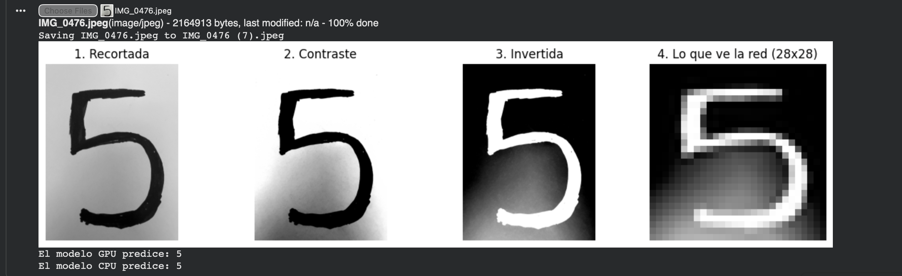

### Bonus — Probabilidades por dígito

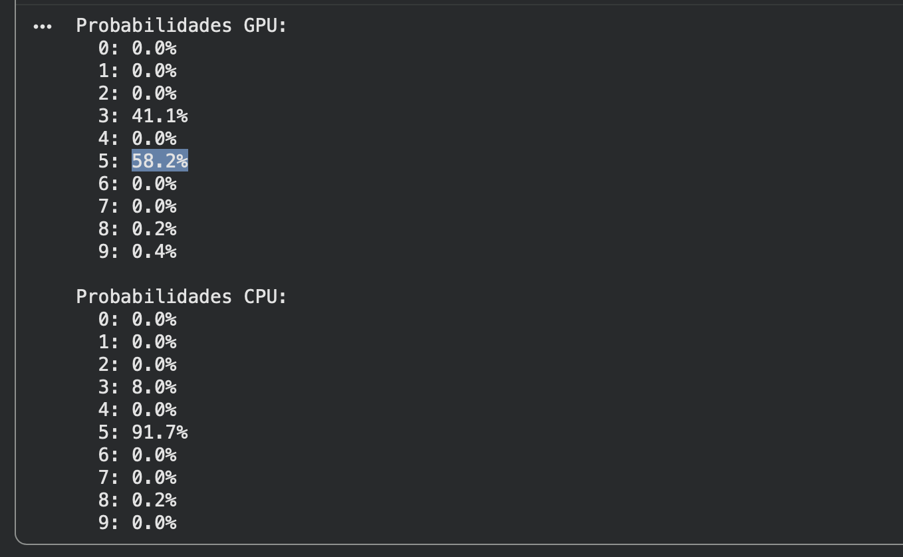

### Preguntas

**1. ¿El modelo acertó con el dígito dibujado? Si falló, ¿por qué? ¿Se parece a los de MNIST?**

Sí, ambos modelos (GPU y CPU) acertaron prediciendo el dígito 5. El trazo es relativamente claro y centrado, con la forma característica del 5 de MNIST: línea horizontal superior, trazo vertical descendente y curva inferior cerrada. Sin embargo, la confianza del modelo GPU fue moderada (58.2%), con el 3 compitiendo con 41.1%, lo que sugiere que la escritura tiene rasgos ambiguos — probablemente la curva inferior es más abierta o el trazo superior menos definido que en los ejemplos de entrenamiento. El modelo CPU fue más seguro (91.7%), posiblemente por diferencias en los pesos o en cómo opera sobre el mismo tensor. En general, el dígito sí se asemeja a los de MNIST tras el preprocesamiento, como se ve en la vista "Lo que ve la red (28x28)".

**2. ¿Por qué el preprocesamiento invierte los colores con `ImageOps.invert`? ¿Qué pasaría si no se hiciera?**

MNIST tiene fondo negro y trazo blanco. Si dibujamos en Paint obtenemos fondo blanco y trazo negro, que es exactamente lo opuesto. Sin la inversión, el modelo vería un patrón completamente diferente al que aprendió durante el entrenamiento y casi siempre predice mal. `ImageOps.invert` convierte el fondo blanco en negro y el trazo negro en blanco, igualando el formato de MNIST.

**3. ¿Probaron con un dígito difícil (4 o 9 poco convencional)? ¿Falló? ¿Qué dice eso de las limitaciones del modelo?**

Si se prueba con un 4 con la parte superior cerrada o un 9 con cola recta, el modelo frecuentemente los confunde entre sí o con un 7/1. Esto expone limitaciones clave: el modelo fue entrenado solo con MNIST, cuyos dígitos fueron escritos por adultos angloparlantes en los años 90, por lo que estilos de escritura latinoamericanos o escolares pueden no estar representados. Además, una red densa (fully connected) sobre 28×28 píxeles es sensible a traslaciones y rotaciones pequeñas — algo que una CNN maneja mejor. El modelo no tiene noción de estructura espacial, solo aprende correlaciones de píxeles individuales.

### Bonus — Preguntas de probabilidades

**1. ¿Cuál dígito tiene la probabilidad más alta en cada modelo? ¿Coincide con la predicción?**

En ambos casos el dígito con mayor probabilidad es el 5, y coincide exactamente con la predicción final. GPU: 5 → 58.2%. CPU: 5 → 91.7%.

**2. ¿El modelo está seguro o dudando? ¿Cómo lo saben mirando los porcentajes?**

Depende del modelo. El CPU está bastante seguro: 91.7% para el 5 y solo 8.0% para el 3, lo que indica una distribución concentrada. El GPU está dudando: 58.2% vs 41.1% es una diferencia pequeña — casi un empate entre 5 y 3. Un modelo seguro tendría >90% en una sola clase y el resto cercano a 0%. Cuando la segunda clase más probable supera el 30–40%, el modelo está en zona de ambigüedad y la predicción es menos confiable.

**3. Si el porcentaje más alto es menor al 50%, ¿confiarían en esa predicción? ¿Por qué?**

No. Un modelo que no supera el 50% de confianza en ninguna clase está efectivamente "adivinando", ya que hay 10 clases posibles y una distribución uniforme daría 10% cada una. Por debajo del 50% la predicción es poco confiable y no debería usarse en una aplicación real sin revisión humana.

---

## Sección 8 — Preguntas de Reflexión Final

**1. ¿En qué se parece PyTorch a programar en CUDA directamente y en qué se diferencia? ¿Cuándo usarían uno y cuándo el otro?**

Se parecen en que ambos transfieren datos entre CPU y GPU, lanzan cómputo paralelo en la GPU y requieren que modelo y datos estén en el mismo dispositivo. La diferencia es el nivel de abstracción: en CUDA en C gestionamos manualmente la memoria (`cudaMalloc`, `cudaFree`), definimos los kernels con `<<<bloques, hilos>>>` y controlamos cada sincronización. PyTorch hace todo eso automáticamente. Usaríamos CUDA en C cuando necesitemos control total del hardware para optimización máxima (por ejemplo, kernels especializados para arquitecturas específicas). Usaríamos PyTorch para investigación y desarrollo de modelos de ML, donde la productividad importa más que el control fino.

**2. Diagrama en Excalidraw: flujo completo desde activar la GPU hasta la predicción final:**

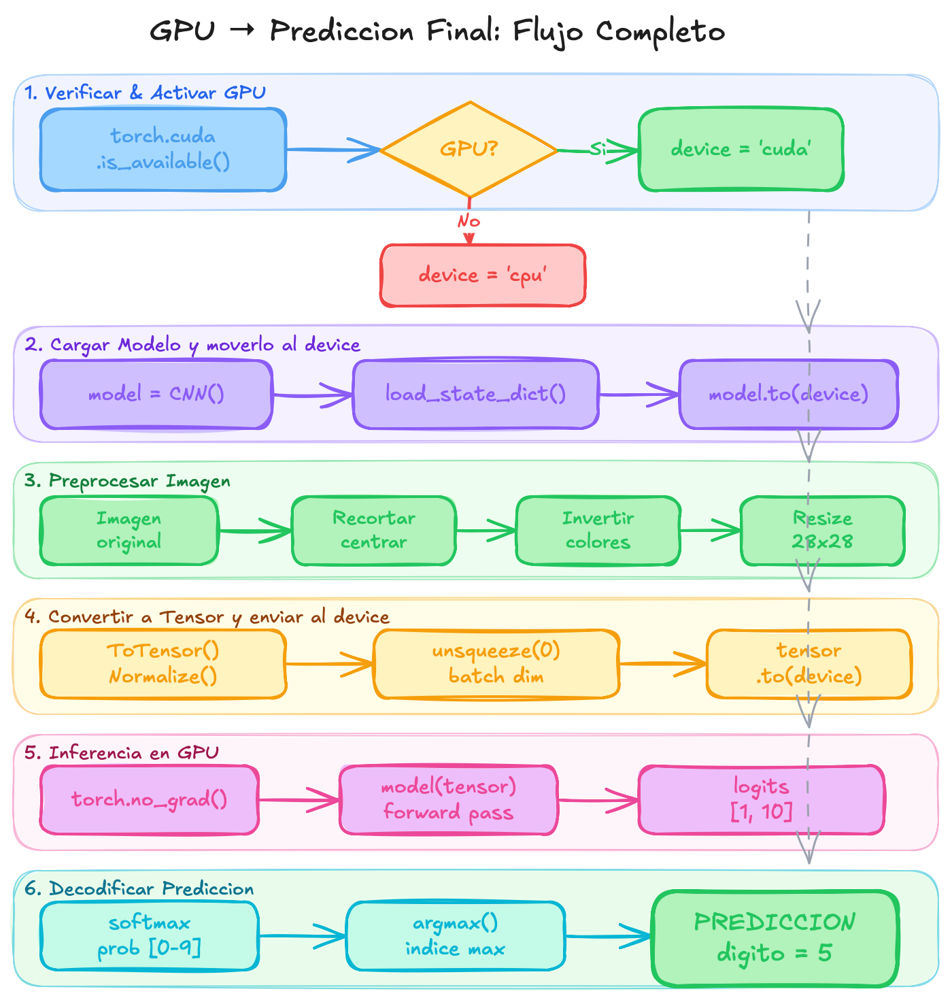

**3. Analogía para explicarle a alguien sin conocimientos de programación qué hace una red neuronal entrenándose en una GPU:**

Una red neuronal entrenándose en GPU es como un estudiante que aprende a reconocer letras del abecedario mirando miles de ejemplos escritos a mano. La GPU es como tener un salón de clases con miles de asistentes que revisan ejemplos al mismo tiempo en paralelo, en vez de revisarlos uno por uno. Cada vez que el estudiante se equivoca, un maestro (el optimizador) le indica exactamente en qué ajustar su criterio. Después de ver suficientes ejemplos, el estudiante puede reconocer letras nuevas que nunca había visto antes.

---

_Programación Paralela y Computación Distribuida · Juan Alejandro Carrillo Jaimes · 2026-I_
